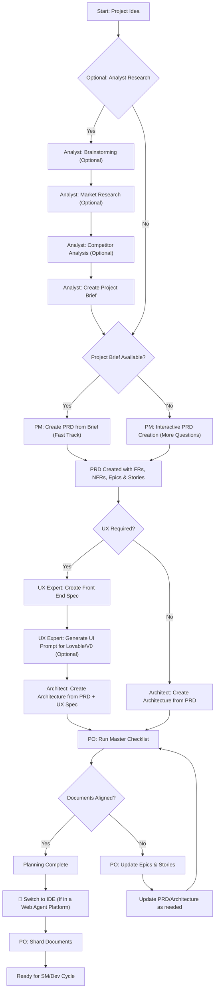
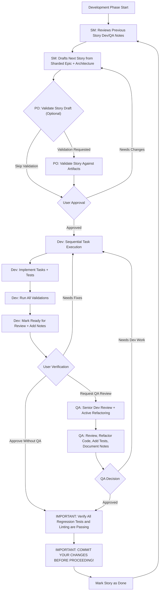

# BMAD Method - Workflows and Development Cycle

## Complete Development Workflow

### Planning Workflow (Web UI or Powerful IDE Agents)

#### Critical Planning Phases

1. **Optional Analysis Phase**
   - Market research and competitive landscape analysis
   - Brainstorming sessions for idea validation
   - Strategic positioning assessment

2. **Project Brief Creation**
   - Foundation document establishment
   - High-level requirements capture
   - Stakeholder alignment

3. **PRD Development**
   - Functional requirements (FRs) definition
   - Non-functional requirements (NFRs) specification
   - Epic and story breakdown structure

4. **UX Specification (Optional)**
   - Front-end design specifications
   - UI component definitions
   - Integration with design tools (Lovable, V0)

5. **Architecture Design**
   - Technical foundation from PRD
   - System component relationships
   - Technology stack decisions

6. **Validation and Alignment**
   - Master checklist execution
   - Cross-document consistency verification
   - Quality gate enforcement

7. **Environment Transition**
   - **CRITICAL**: Switch from web UI to IDE
   - Document transfer to project folders
   - Development environment preparation

8. **Document Sharding**
   - Large document breakdown for development consumption
   - Context optimization for agent consumption
   - Story-level detail preparation

### Core Development Cycle (IDE)

#### Development Cycle Stages

1. **Story Context Review**
   - SM reviews previous development and QA notes
   - Analyzes implementation patterns and lessons learned
   - Maintains continuity across development cycles

2. **Story Drafting**
   - SM creates hyper-detailed story from sharded epic
   - Includes full architectural context and implementation guidance
   - Embeds specific technical requirements and constraints

3. **Optional Validation**
   - PO validates story against planning artifacts
   - Ensures alignment with PRD and architecture
   - Maintains consistency with project requirements

4. **User Approval Gate**
   - Human review and approval of story details
   - Opportunity for refinement before implementation
   - Quality control before development begins

5. **Sequential Implementation**
   - Dev agent executes tasks in defined order
   - Implements features with comprehensive test coverage
   - Follows architectural patterns and coding standards

6. **Validation and Testing**
   - All automated tests must pass
   - Linting and code quality checks
   - Integration and regression test verification

7. **Review Preparation**
   - Dev marks work ready with detailed implementation notes
   - Documents any decisions, assumptions, or technical debt
   - Prepares context for potential QA review

8. **Quality Assurance (Optional)**
   - QA performs senior developer review
   - Active refactoring for code quality improvement
   - Adds additional tests and documentation
   - Provides learning and knowledge transfer

9. **Final Validation**
   - **CRITICAL**: All regression tests and linting must pass
   - No broken functionality introduced
   - Code quality standards maintained

10. **Commit and Continuation**
    - **MANDATORY**: Commit changes before proceeding
    - Mark story as complete
    - Cycle continues with next story

## Workflow Orchestration

### BMad Orchestrator Role
- **Workflow Guidance**: Uses workflow definitions to guide users through complete processes
- **Phase Transitions**: Ensures proper handoffs between planning and development phases
- **Quality Gates**: Enforces validation requirements at critical checkpoints
- **Context Management**: Maintains workflow state and progression tracking

### Interactive Modes

#### Incremental Mode
- **Step-by-Step**: User input required at each decision point
- **High Control**: Maximum user involvement in process decisions
- **Learning Friendly**: Great for understanding BMad methodology
- **Quality Focus**: Thorough validation at each stage

#### YOLO Mode  
- **Rapid Generation**: Minimal user interaction required
- **Speed Optimization**: Fast progression through workflow stages
- **Assumption-Based**: AI makes reasonable decisions autonomously
- **Iteration Friendly**: Quick cycles for experimental development

## Workflow Customization

### Project Type Variations

#### Greenfield Projects
- **Full Planning Cycle**: Complete analyst → PM → architect → development flow
- **Clean Architecture**: Start with optimal design patterns
- **Technology Selection**: Freedom to choose best-fit technologies
- **Process Learning**: Ideal for understanding complete methodology

#### Brownfield Projects
- **Architecture Analysis**: Existing system assessment and documentation
- **Integration Planning**: How new features fit existing patterns
- **Technical Debt Management**: Identification and remediation strategies
- **Migration Strategies**: Gradual improvement approaches

### Domain-Specific Workflows
- **Software Development**: Core BMad methodology
- **Game Development**: Asset creation, level design, narrative flows
- **Business Strategy**: Market analysis, financial modeling, operational planning
- **Creative Writing**: Plot development, character creation, world building
- **Education**: Curriculum design, assessment creation, learning objective definition

## Best Practices

### Context Management
- **Keep Files Lean**: Only include essential information in context
- **Regular Compaction**: Compress conversation history to maintain performance
- **Focused Agents**: Use appropriate agent for specific tasks
- **Clean Organization**: Maintain structured project file organization

### Quality Assurance
- **Test Coverage**: Comprehensive testing at every development cycle
- **Code Review**: Utilize QA agent for senior developer perspective
- **Regression Prevention**: Always validate existing functionality
- **Documentation**: Maintain clear implementation notes and decisions

### Continuous Improvement
- **Feedback Integration**: Capture lessons learned in technical preferences
- **Process Refinement**: Adjust workflows based on project experience
- **Agent Optimization**: Improve agent prompts and templates over time
- **Community Contribution**: Share successful patterns and improvements